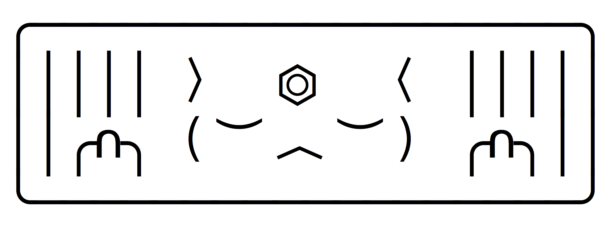

## Carcer

A mechanism for projection

### Getting Started

1.  `git clone https://github.com/DreamsMakeToys/carcer.git`
2.  `cd ./carcer`
3.  `yarn install`
4.  `yarn build`
5.  `yarn start`

_*Warning:*_ Don't run this while online. The current way expressions are handled allow for remote code execution. This will be addressed in the next version.

### Goals

* **_generalize interaction_**
* **_centralize complexity_**

### Forces

* **_progress not perfection_**
* **_javascript is king, and like a good king it should delegate werk that it isn't suited for_**
* **_pretend your users won't misuse_**
